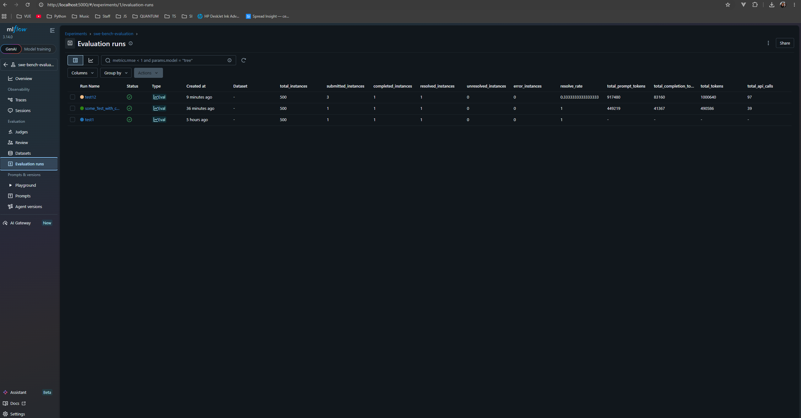
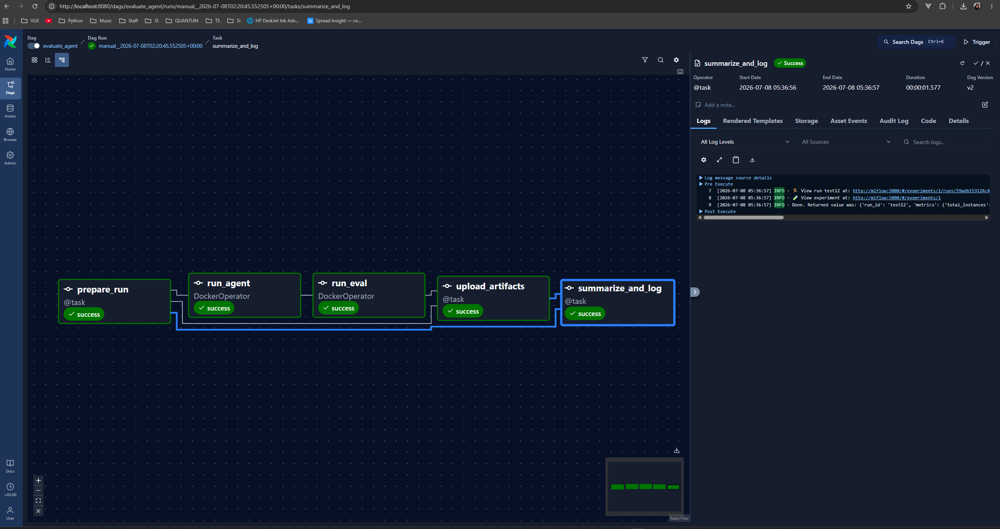
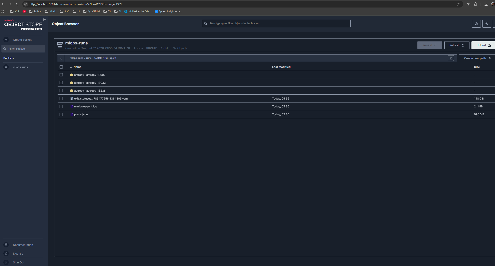

# REPORT: Evaluation Pipeline for Coding-Agent Experiments

MLOps module, lecture #6 — "End-to-end ML pipeline" home assignment.

Converts ad-hoc mini-swe-agent / SWE-bench scripts into a configurable,
observable, reproducible Airflow pipeline with MLflow tracking and
S3-compatible artifact storage.

---

## 1. Architecture

### Pipeline

The `evaluate_agent` DAG implements the full workflow:
prepare_run -> run_agent -> run_eval -> upload_artifacts -> summarize_and_log

| Task | Type | What it does |
|---|---|---|
| `prepare_run` | Python `@task` | Reads Airflow params, generates `run_id` (auto or user-provided), creates `runs/<run-id>/` tree, writes `config.json` |
| `run_agent` | `DockerOperator` | Runs `mini-extra swebench` in an isolated container; writes trajectories and `preds.json` to `runs/<run-id>/run-agent/` |
| `run_eval` | `DockerOperator` | Runs the SWE-bench evaluation harness on `preds.json`; copies logs and the summary into `runs/<run-id>/run-eval/` |
| `upload_artifacts` | Python `@task` | Uploads the whole `runs/<run-id>/` tree to MinIO (S3 API via boto3); returns the `s3://` URI |
| `summarize_and_log` | Python `@task` | Parses the eval summary into `metrics.json`, writes `manifest.json`, logs params/metrics/artifacts and the S3 URI to MLflow |

### Deployment (docker-compose)
docker-compose.yaml
├── postgres       Airflow metadata DB
├── airflow-init   one-shot DB migration
├── airflow        Airflow 3.3 standalone (UI :8080)
├── mlflow         MLflow tracking server (UI :5000)
├── minio          S3-compatible object storage (API :9000, console :9001)
└── minio-init     one-shot bucket creation (mlops-runs)

### Execution isolation (Docker-in-Docker via socket mount)

`run_agent` and `run_eval` execute inside containers built from the project
`Dockerfile` (image `mlops-assignment:latest`). Both tools internally spawn
Docker containers for SWE-bench instances. The host Docker socket
(`/var/run/docker.sock`) is mounted into these containers, so all "nested"
containers are actually **sibling containers** created on the host daemon.

Because sibling containers are created by the *host* daemon, all bind-mount
sources must be host paths. When Airflow itself runs in Compose, the DAG takes
these from `HOST_PROJECT_DIR` / `HOST_HF_CACHE_DIR` env vars, with fallbacks
for the standalone mode.

Shared mounts for agent/eval containers:
- `/var/run/docker.sock` — access to the host Docker daemon
- `<host>/runs` -> `/mlops-assignment/runs` — run artifacts survive container removal
- `<host>/.cache/huggingface` -> `/root/.cache/huggingface` — dataset cache reuse across runs

---

## 2. How to trigger a run

### Prerequisites (once per machine)

1. Copy `.env.example` to `.env` and fill in:
   - `NEBIUS_API_KEY`, `HF_TOKEN`
   - `HOST_PROJECT_DIR`, `HOST_HF_CACHE_DIR` — absolute host paths
   - `AIRFLOW_UID` (`id -u`), `DOCKER_GID` (`getent group docker | cut -d: -f3`)
2. Build the task image: `docker build -t mlops-assignment:latest .`
3. Start the stack: `docker compose up -d`
4. Forward ports (from your local machine):
   `ssh -L 8080:localhost:8080 -L 5000:localhost:5000 -L 9001:localhost:9001 <user>@<vm-ip>`

### Trigger via Airflow UI

1. Open http://localhost:8080, log in (admin / see
   `simple_auth_manager_passwords.json.generated` inside the container).
2. Open the `evaluate_agent` DAG -> Trigger DAG.
3. Set parameters in the form:

| Param | Default | Meaning |
|---|---|---|
| `split` | `test` | SWE-bench split |
| `subset` | `verified` | `verified` -> SWE-bench_Verified, otherwise SWE-bench_Lite |
| `workers` | `5` | Parallel instances for both agent and eval |
| `model` | `nebius/moonshotai/Kimi-K2.6` | LLM identifier (litellm format) |
| `task_slice` | `0:3` | Slice of the dataset to run |
| `run_id` | auto | Optional explicit run ID |
| `cost_limit` | `0` | Recorded in config (batch CLI has no such option) |

### Rerun / reproduce by run-id

Every run is fully described by `runs/<run-id>/config.json`. To reproduce:
trigger the DAG with the same parameter values (and optionally the same
`run_id` — artifacts will land in the same folder). The config, dataset
slice, and model ID pin down the experiment; trajectories and eval logs
allow post-hoc inspection without re-running.

---

## 3. Artifact layout

Each run produces a self-contained directory:
runs/<run-id>/
config.json          # full run configuration + timestamp
metrics.json         # parsed evaluation metrics
manifest.json        # index of artifacts + local and S3 URIs
run-agent/
preds.json         # model patches, keyed by instance_id
<instance_id>/     # one folder per instance
*.traj.json      # full agent trajectory (steps, commands, outputs)
minisweagent.log
run-eval/
summary.json       # aggregate results (resolved/unresolved/errors)
logs/<model>/<instance_id>/
report.json      # per-instance test results (FAIL_TO_PASS etc.)
patch.diff, eval.sh, run_instance.log, test_output.txt

The same tree is uploaded to MinIO under `s3://mlops-runs/runs/<run-id>/`
by the `upload_artifacts` task, and the URI is stored both in
`manifest.json` and as an MLflow tag (`artifact_s3_uri`).

**Note:** `metrics.json` and `manifest.json` are produced *after* the S3
upload (per the suggested `log-artifacts-to-s3 -> log-metrics-to-mlflow`
ordering), so the S3 copy contains the raw run outputs; the final metrics
live in MLflow and in the local folder.

---

## 4. MLflow tracking

Every run logs to the `swe-bench-evaluation` experiment on the MLflow
server (http://localhost:5000):

- **Params:** `run_id`, `model`, `split`, `subset`, `task_slice`, `workers`, `cost_limit`
- **Metrics:** `total_instances`, `submitted_instances`, `completed_instances`,
  `resolved_instances`, `unresolved_instances`, `error_instances`, `resolve_rate`
- **Tags:** `artifact_s3_uri` — pointer to the full artifact tree in MinIO
- **Artifacts:** `config.json`, `metrics.json`, `manifest.json`

Multiple runs can be compared side-by-side in the MLflow UI (e.g. different
models or slices).



---

## 5. Completed evaluation example

[TODO: fill in after the compose run finishes]

- Run ID: `[TODO]`
- Parameters: model `nebius/moonshotai/Kimi-K2.6`, subset `verified`,
  split `test`, slice `[TODO]`, workers `[TODO]`
- Result: `[TODO]` of `[TODO]` instances resolved (resolve_rate `[TODO]`)
- Artifacts: `runs/[TODO]/` locally, `s3://mlops-runs/runs/[TODO]/` in MinIO
- MLflow run: see screenshot above




---

## 6. Engineering notes / problems encountered

### Airflow 3.3 specifics
- The `mini-extra swebench` batch CLI has no `--cost-limit` option (only
  `swebench-single` does) — the param is recorded in `config.json` but not
  passed to the batch command.
- SWE-bench harness writes its summary to `<model_slug>.<run_id>.json` in
  the CWD (not `<model_slug>.<split>.json`) — the eval task copies it into
  `runs/<run-id>/run-eval/summary.json`.
- MLflow 3.x rejects the legacy filesystem tracking backend; local fallback
  uses `sqlite:///mlflow.db`, Compose uses the `http://mlflow:5000` server.

### DNS inside Compose networks on Nebius
The host resolver is `127.0.0.53` (systemd-resolved), and Docker hands
containers the cloud-internal resolver `169.254.169.2`. That link-local
address is reachable from the default bridge network but **not** from
user-defined Compose networks, so `pip install` inside the Airflow
container failed with `NameResolutionError`. Fix — explicit DNS list in
`/etc/docker/daemon.json`:

```json
{ "dns": ["169.254.169.2", "8.8.8.8", "1.1.1.1"] }
```

### Host paths for sibling containers
The first Compose run failed because mount sources were container-side
paths (`/opt/airflow/runs`), which the host daemon resolved to empty
directories. Solved by passing `HOST_PROJECT_DIR` / `HOST_HF_CACHE_DIR`
through the environment.

### HuggingFace cache
Without a shared cache mount, every agent/eval container re-downloaded the
SWE-bench dataset on start. Mounting the host HF cache removed the
overhead.

---

## 7. What could be improved

- Build a custom Airflow image with mlflow/boto3/docker-provider baked in
  instead of `_PIP_ADDITIONAL_REQUIREMENTS` (which reinstalls on every
  container start and is dev-only).
- Replace `DockerOperator` with `KubernetesPodOperator` for real
  multi-node scale-out.
- Push `mlops-assignment:latest` to a registry instead of relying on a
  locally built image.
- Structured metrics per instance (currently only aggregate counts).